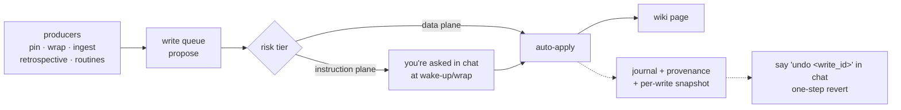

# RenOS <ruby>仁<rt>ren</rt></ruby>

**An agentic OS for Claude Code** — memory that compounds, tokens that aren't wasted, autonomy you can trust.

[](https://github.com/hazarsozer/ren-os/actions/workflows/validate.yml)


RenOS is a knowledge + governance layer that runs **on top of** coding-agent harnesses
(Claude Code first; [read-proven on Codex](docs/codex-read-proof.md)). Everything it
knows lives in a plain-markdown wiki **you own** at `~/.renos/wiki` — readable without
RenOS, portable to any harness, openable as an Obsidian vault.

---

## Install

Inside Claude Code:

```
/plugin marketplace add hazarsozer/ren-os
/plugin install ren@ren-os
```

Then, in your first session:

```
/ren:install
```

That's the whole onboarding — an idempotent guided flow (environment check, wiki
bootstrap, optional 10-question identity interview, backup nag, companion offers, first project). Every
stage is skippable except the wiki bootstrap, and re-running resumes wherever you
stopped. End it with `/ren:ingest-project` on any existing repo and you get the
**first-session artifact**: *"I set up your project memory — here's what I captured."*

> **Requirements:** Claude Code with plugin support, Python ≥ 3.11, `uv` (skills run
> their mechanical cores via `uv run`). No API keys, no services, no telemetry — see
> [What stays local](docs/data-flow.md).

---

## The three pillars

| Pillar | What it means in practice |
|---|---|
| 🧠 **Memory that compounds** | User-owned markdown every session reads *and extends* — with update/correct/revert semantics, never append-only. One write queue is the single door every producer writes through. |
| 🪙 **Tokens that aren't wasted** | Every injected byte budgeted, cached, or pointed-to. No LLM call at session start, by design. Real cache-token accounting and a calibrated estimator replace guesswork. |
| 🛡️ **Autonomy you can trust** | Writes governed by **risk tier + provenance**, not faith. Reads are free; memory auto-applies with journal + one-step revert; only promotions into standing instructions ask you (in chat); code/config diffs and destructive actions still gate. |

**The success bar is measured, not vibes** — per spec §2: *"if 0.2 ships and the
pillars are still estimates, 0.2 failed."* See [Measured numbers](#measured-numbers)
for where each exit criterion actually stands.

---

## How it's organized

### Memory hierarchy

```
            you / your sessions
                    │
   ┌────────────────┼──────────────────┐
   ▼                ▼                  ▼
 L1  session     L2  project        L3  recall
 notes, quaran-  pointer-maps       on-demand fetch,
 tine-bannered   projects/<slug>/   every miss logged
 until reviewed  map.md             (honest hit rate)
   │                │                  │
   └────────────────┴──────────────────┘
                    │  promotion (gated, never automatic)
                    ▼
          global tier — typed, durable knowledge
          decisions/ · patterns/ · research/ · identity
```

### Instruction hierarchy

RenOS rides Claude Code's **native** global → project instruction-file hierarchy
for its instruction layer — doctrine lives in CLAUDE.md files, not in an
injected prompt. (The wake-up hook does inject **data-plane** context: your
recent session summary, the project map, and related pages — knowledge, never
instructions.)

```
~/.claude/CLAUDE.md          ← managed block: behavioral core + recall doctrine
   │                            + doctrine index (markers only; your content
   │                            outside them is never touched — dedup-aware)
   └── <your-repo>/CLAUDE.md ← thin pointer block → that project's L2 map
                                (points, never duplicates)
```

### Every write goes through one door



Provenance on every write, an append-only journal, per-write snapshots, file leases
against lost updates, and quarantine banners on unreviewed LLM-authored content —
that's the write-safety substrate (`lib/memory/`), and it's the only code that ever
touches a wiki page.

---

## The skill surface

Seventeen skills, each declaring an **execution tier** — deterministic scripts run as
scripts, worker-shaped drafting delegates to cheap subagent models, and judgment
(approvals, session narrative) stays with the main model.

### Getting started
| Skill | What it's for |
|---|---|
| `/ren:install` | One-time onboarding: wiki bootstrap, identity, global instruction layer, backup nag |
| `/ren:interview` | Identity + working-style interview (capped at 10 questions, skippable, sane defaults) |
| `/ren:ingest-project [path]` | Bring an **existing** repo in as a populated L2 map — the first-session artifact |
| `/ren:bootstrap-project <slug>` | Start a brand-new project's memory (empty L2 map) |

### Daily loop
| Skill | What it's for |
|---|---|
| `/ren:pin "<text>"` | Reactive memory: "remember it like THIS" (`--wrong` / `--instead` to correct) |
| `/ren:recall "<query>"` | On-demand fetch — every miss logged, so the hit rate is honest |
| `/ren:remember` | "What do you remember about this project?" — renders the live L2 map |
| `/ren:wrap` | End-of-session consolidation behind a **fail-closed** classifier gate |

### Governance
| Skill | What it's for |
|---|---|
| _(conversational)_ | Suggestions surface at wake-up and wrap; answer in chat — no queue verbs. Say "undo \<write_id>" to revert a write |
| `/ren:routine-init` | Declare a bounded routine: schedule, exit criterion, failure handler, capability/path allowlist |
| `/ren:metric-watch` | The minimal watch routine: budget growth, memory growth, gate failures → journal findings |

### Maintenance
| Skill | What it's for |
|---|---|
| `/ren:doctor` | Twelve isolated health checks — env, wiki structure, frontmatter, schema versions, budgets, dangling pointers, execution tiers, backup config, global-tier drift, harness neutrality |
| `/ren:wiki-health` | Coherence auditor: dangling pointers, contradictions, mass-deletion anomaly, quarantine inventory |
| `/ren:backup` | Git-push-to-`backup`-remote primary, tarball fallback, retention |
| `/ren:update` | Snapshot → migrate → verify → diff-approve → apply, rollback built in |
| `/ren:retrospective [--since]` | Mine instrumentation + journal + session history for lessons and skill candidates (with executable scaffolds) |
| `/ren:code-map` | Optional Graphify-backed structural code map (graceful absence if not installed) |
| `/ren:wiki-migration` | Schema-version migrations for wiki pages, scripted + verified |

---

## What's on disk

**Your wiki** (`~/.renos/wiki` — yours, plain markdown, Obsidian-vault-compatible):

```
~/.renos/wiki/
├── index.md            # the wiki's own map
├── identity.md         # who you are, how you work
├── log.md              # chronological session log
├── projects/<slug>/    # one L2 pointer-map per project
├── decisions/          # durable decisions (promotion-gated)
├── patterns/           # recurring approaches worth naming
├── research/           # ingested sources, distilled
├── alternatives/       # roads not taken, and why
└── .ren/               # queue, journal, snapshots, locks, install state
```

**This repo** (the plugin):

```
ren-os/
├── .claude-plugin/     # plugin + marketplace manifests
├── skills/             # the 17 /ren: skills (SKILL.md contract + lib/ core each)
├── lib/                # memory substrate, governance, instrumentation, adapters
├── doctrine/           # always-on + on-demand operating doctrine
├── wiki-skeleton/      # the templates /ren:install stamps (never dev content)
├── hooks/              # wake-up + pre-push content guard
├── migrations/         # scripted schema migrations with verification
├── docs/               # data-flow, exit criteria, Codex read proof
└── tests/              # the full test suite — every DONE claim below has one
```

---

## Measured numbers

Status of each 0.2 exit criterion as of this commit — nothing asserted from vibes:
every **DONE** has a test file; every **PENDING** is calendar-bound (needs real
elapsed usage, not more code).

| # | Exit criterion | Status |
|---|---|---|
| 1 | Real `cache_read_input_tokens` across ≥20 sessions, published | ⏳ PENDING — harness built + tested; the collection run needs real usage |
| 2 | Injected-context size + retrieval hit rate vs. frozen fixture + mechanical miss log | ⏳ PENDING — recording is live; fixture scores 12/12; the ≥20-session hit rate still needs computing |
| 3 | Token estimator calibrated against the real tokenizer | ⏳ PENDING — calibration harness built + unit-tested; needs live samples |
| 4 | Wrap classifier eval passes and demonstrably gates (fail-closed) | ✅ DONE — a crash refuses to durable-promote (`tests/skills/wrap/test_gate_eval.py`) |
| 5 | A foreign harness can read the knowledge layer | ✅ DONE — [Codex read proof](docs/codex-read-proof.md), passed live |
| 6 | Friend week (real usage by someone who isn't the founder) | ⏳ PENDING — calendar-bound |
| 7 | Integrity drill: revert, quarantine, lost-update detection under rehearsed failure | ✅ DONE in the suite; a real-world rehearsal log is a separate pending artifact |

---

## Portability & ownership

- **The wiki is the product.** Delete RenOS and your knowledge remains readable
  markdown. No lock-in by construction.
- **Obsidian-compatible** — open `~/.renos/wiki` as a vault for a free knowledge
  graph. `tests/test_obsidian_invariant.py` pins the invariants that keep this true.
- **Harness-neutral by design** — the wiki is plain markdown any coding agent
  can read; `lib/portability/agents_surface.py` renders an `AGENTS.md` pointer
  file, and Codex cited wiki pages from a rendered `AGENTS.md` in the
  [live proof](docs/codex-read-proof.md). Automatic `AGENTS.md` generation at
  install/bootstrap is not wired yet (planned for 0.4) — today the renderer is
  a library you can call, not a shipped flow.
- **Local-first** — see [docs/data-flow.md](docs/data-flow.md) for exactly what stays
  local (everything), what ever reaches a model API (your session content, as always),
  and what never does (the wiki is never uploaded by RenOS itself).

## Developing

```bash
git clone https://github.com/hazarsozer/ren-os.git && cd ren-os
uv sync
uv run pytest            # the full test suite
uv run python scripts/lint-yaml-frontmatter.py
```

Runtime deps are just `python-ulid`, `pyyaml`, `typing-extensions`. `CHANGELOG.md`
records what changed and why, release to release; `docs/exit-criteria.md` is the
honest scoreboard.

## License

MIT — see `LICENSE`. Wiki-skeleton templates and doctrine ship under the same
license; third-party attributions in `wiki-skeleton`'s `LICENSES.md` stamp. The
behavioral core in the global instruction layer is adapted, with attribution, from
Andrej Karpathy's public CLAUDE.md guidelines.
