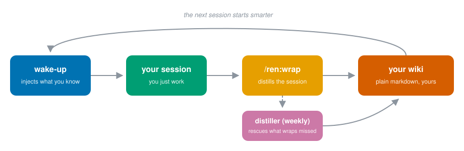
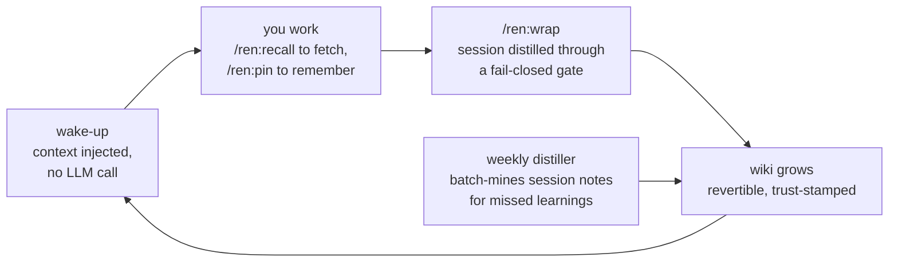
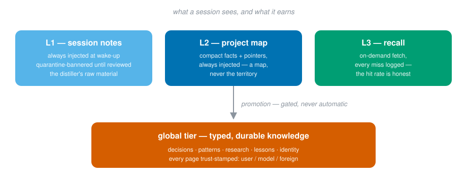
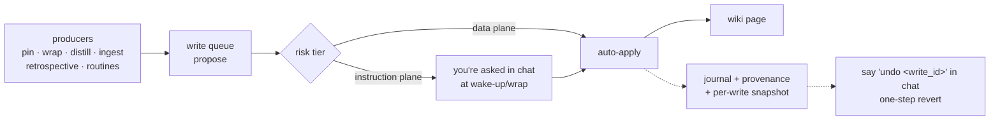

# RenOS <ruby>仁<rt>ren</rt></ruby>

**An agentic OS for Claude Code** — memory that compounds, tokens that aren't wasted, autonomy you can trust.

[](https://github.com/hazarsozer/ren-os/actions/workflows/validate.yml)


Every session with a coding agent starts from zero. The decisions you made
yesterday, the preferences you explained last week, the lesson that one painful
bug taught you — gone, unless *you* carry them forward by hand. RenOS is a
knowledge + governance layer that runs **on top of** coding-agent harnesses
(Claude Code first; [read-proven on Codex](docs/codex-read-proof.md)) and makes
the carrying automatic — and safe.



Everything it knows lives in a plain-markdown wiki **you own** at
`~/.renos/wiki` — readable without RenOS, portable to any harness, openable as
an Obsidian vault. Delete the plugin and your knowledge stays.

---

## Why RenOS

- **Agents forget. Your wiki doesn't.** Each session opens with a wake-up card
  built from what previous sessions learned — who you are, what this project
  is, what happened last time, what's waiting on your answer. Each session
  ends by distilling what it learned back into the wiki, with
  update/correct/revert semantics, never append-only. A weekly distiller
  batch-mines the session notes for anything the end-of-session pass missed,
  so learnings don't die in the archive.
- **Context is expensive. Every byte is budgeted.** The wake-up card renders
  to a byte ceiling with sections ordered by irreplaceability; no LLM call at
  session start, by design. Real cache-token accounting and a calibrated
  estimator replace guesswork about what injection costs.
- **Autonomy is scary. So every write goes through one door.** Reads are free;
  memory writes auto-apply through a single governed queue with provenance, an
  append-only journal, per-write snapshots, and one-step revert ("undo
  `<write_id>`" in chat). Only promotions into standing instructions ask you.
  Every page carries a trust stamp — `user` / `model` / `foreign` — minted at
  write time, so a page's origin is never guessed after the fact.

The deep version of all three — tiers, gates, guards, instrumentation — lives
in [docs/architecture.md](docs/architecture.md).

---

## Install

Inside Claude Code:

```
/plugin marketplace add hazarsozer/ren-os
/plugin install ren@ren-os
```

Then, in your first session:

```
/ren:install
```

That's the whole onboarding — an idempotent guided flow (environment check,
wiki bootstrap, optional 10-question identity interview, backup nag, companion
offers, first project). Every stage is skippable except the wiki bootstrap, and
re-running resumes wherever you stopped. End it with `/ren:ingest-project` on
any existing repo and you get the **first-session artifact**: *"I set up your
project memory — here's what I captured."*

> **Requirements:** Claude Code with plugin support, Python ≥ 3.11, `uv`
> (skills run their mechanical cores via `uv run`). No API keys, no services,
> no telemetry — see [What stays local](docs/data-flow.md).

---

## A day with RenOS


```mermaid
flowchart LR
    W["wake-up<br/>context injected,<br/>no LLM call"] --> S["you work<br/>/ren:recall to fetch,<br/>/ren:pin to remember"]
    S --> E["/ren:wrap<br/>session distilled through<br/>a fail-closed gate"]
    E --> K["wiki grows<br/>revertible, trust-stamped"]
    D["weekly distiller<br/>batch-mines session notes<br/>for missed learnings"] --> K
    K --> W
```

- **Session start** — the wake-up hook injects the card: identity, project
  overview, last session's notes, the project map, active routines, and
  anything waiting on your decision. Question-shaped knowledge, never
  instructions.
- **Mid-session** — `/ren:recall "<query>"` fetches on demand (every miss is
  logged, so the hit rate is honest); `/ren:pin "<text>"` captures a fact the
  moment you state it; `/ren:remember` renders what the system knows about the
  current project.
- **Session end** — `/ren:wrap` writes the session narrative and gates
  candidate durable learnings through a classifier that biases hard toward
  *not* durable. Verdicts come from a real classifier pass; anything the
  classifier affirms but can't place is held for you as a suggestion — nothing
  dies silently.
- **Weekly** — the `/ren:distill` routine re-mines session narratives behind a
  watermark for learnings the live gate missed, capped and journaled, through
  the same write door as everything else.

---

## The knowledge you own



```
~/.renos/wiki/
├── index.md            # the wiki's own map
├── identity.md         # who you are, how you work
├── log.md              # chronological session log
├── projects/<slug>/    # map.md · overview.md · schema.md · knowledge/ · raw/ · l1/
├── decisions/          # durable decisions (promotion-gated)
├── patterns/           # recurring approaches worth naming
├── research/           # ingested sources, distilled
└── .ren/               # queue, journal, snapshots, locks, install state
```

- **The wiki is the product.** Plain markdown, no lock-in by construction —
  `tests/test_obsidian_invariant.py` pins the invariants that keep it a valid
  Obsidian vault.
- **Harness-neutral** — any coding agent can read it; a rendered `AGENTS.md`
  pointer file let Codex cite wiki pages in the
  [live proof](docs/codex-read-proof.md).
- **Local-first** — [docs/data-flow.md](docs/data-flow.md) documents exactly
  what stays local (everything) and what RenOS itself never uploads (the wiki).

---

## The skill surface

Nineteen skills, each declaring an **execution tier** — deterministic scripts
run as scripts, worker-shaped drafting delegates to cheap subagent models, and
judgment (approvals, session narrative) stays with the main model.

### Getting started
| Skill | What it's for |
|---|---|
| `/ren:install` | One-time onboarding: wiki bootstrap, identity, global instruction layer, backup nag |
| `/ren:interview` | Identity + working-style interview (capped at 10 questions, skippable, sane defaults) |
| `/ren:ingest-project [path]` | Bring an **existing** repo in as a populated L2 map — the first-session artifact |
| `/ren:bootstrap-project <slug>` | Start a brand-new project's memory (empty L2 map) |

### Daily loop
| Skill | What it's for |
|---|---|
| `/ren:pin "<text>"` | Reactive memory: "remember it like THIS" (`--wrong` / `--instead` to correct) |
| `/ren:recall "<query>"` | On-demand fetch — every miss logged, so the hit rate is honest |
| `/ren:remember` | "What do you remember about this project?" — renders the live L2 map |
| `/ren:wrap` | End-of-session consolidation behind a **fail-closed** classifier gate |

### Knowledge flow & governance
| Skill | What it's for |
|---|---|
| `/ren:distill` | Batch-mine session narratives for learnings the live gate missed — watermarked, capped, revertible |
| `/ren:suggestions` | Review pending suggestions one at a time — accept/decline in chat, rare and high-stakes by design |
| _(conversational)_ | Suggestions also surface at wake-up and wrap; answer in chat — no queue verbs. Say "undo \<write_id>" to revert a write |
| `/ren:routine-init` | Declare a bounded routine: schedule, exit criterion, failure handler, capability/path allowlist |
| `/ren:metric-watch` | The minimal watch routine: budget growth, memory growth, gate failures, dead classifier wiring → journal findings |

### Maintenance
| Skill | What it's for |
|---|---|
| `/ren:doctor` | Twenty-five isolated health checks — env, wiki structure, schema versions, budgets, pointers, tiers, guards, drift — all warn-not-block |
| `/ren:wiki-health` | Coherence auditor: dangling pointers, contradictions, mass-deletion anomaly, quarantine inventory |
| `/ren:backup` | Git-push-to-`backup`-remote primary, tarball fallback, retention |
| `/ren:update` | Snapshot → migrate → verify → diff-approve → apply, rollback built in |
| `/ren:retrospective [--since]` | Mine instrumentation + journal + session history for lessons and skill candidates |
| `/ren:code-map` | Optional Graphify-backed structural code map (graceful absence if not installed) |
| `/ren:wiki-migration` | Schema-version migrations for wiki pages, scripted + verified |

---

## Governed by construction


```mermaid
flowchart LR
    P["producers<br/>pin · wrap · distill · ingest<br/>retrospective · routines"] --> Q["write queue<br/>propose"]
    Q --> T{"risk tier"}
    T -- data plane --> A["auto-apply"]
    T -- instruction plane --> R["you're asked in chat<br/>at wake-up/wrap"] --> A
    A --> W["wiki page"]
    A -.-> J["journal + provenance<br/>+ per-write snapshot"]
    J -.-> V["say 'undo &lt;write_id&gt;' in chat<br/>one-step revert"]
```

Provenance on every write, an append-only journal, per-write snapshots, file
leases against lost updates, and quarantine banners on unreviewed LLM-authored
content — that's the write-safety substrate (`lib/memory/`), and it's the only
code that ever touches a wiki page. The full account — memory tiers, the
wake-up composer, trust classes, the judge, decay and consolidation, the
guards, and what's instrumented — is in
[docs/architecture.md](docs/architecture.md); the honest scoreboard of measured
exit criteria is [docs/exit-criteria.md](docs/exit-criteria.md).

---

## Developing

```bash
git clone https://github.com/hazarsozer/ren-os.git && cd ren-os
uv sync
uv run pytest            # the full test suite
uv run python scripts/lint-yaml-frontmatter.py
```

Runtime deps are just `python-ulid`, `pyyaml`, `typing-extensions`.
`CHANGELOG.md` records what changed and why, release to release.

## License

MIT — see `LICENSE`. Wiki-skeleton templates and doctrine ship under the same
license; third-party attributions in `wiki-skeleton`'s `LICENSES.md` stamp. The
behavioral core in the global instruction layer is adapted, with attribution,
from Andrej Karpathy's public CLAUDE.md guidelines.
