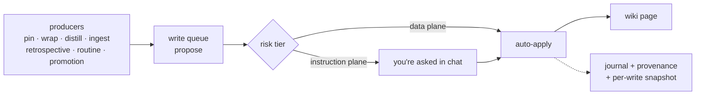

# RenOS architecture

The deep account behind the README's claims, current as of 0.8.0. Everything
here is implemented and tested in this repo; where a behavior has a governing
issue or spec, it's named so you can trace the decision.

---

## Memory tiers

```
            you / your sessions
                    │
   ┌────────────────┼──────────────────┐
   ▼                ▼                  ▼
 L1  session     L2  project        L3  recall
 notes — always  pointer-maps —     on-demand fetch
 injected,       always injected    (/ren:recall),
 quarantine-     (foreign-stamped   every miss logged:
 bannered until  pages held out)    a fetch wake-up
 reviewed                           could have surfaced
                                    = a recorded miss
   │                │                  │
   └────────────────┴──────────────────┘
                    │  promotion (gated, never automatic)
                    ▼
          global tier — typed, durable knowledge
          decisions/ · patterns/ · research/ · lessons/ · identity
```

- **L1** — one narrative page per session (`l1/session-<id>.md`, or
  `projects/<slug>/l1/` when project-scoped), written by `/ren:wrap`, always
  quarantine-bannered as unreviewed LLM-authored content. L1s are also the
  distiller's raw material (below).
- **L2** — one compact pointer-map per project (`projects/<slug>/map.md`):
  general knowledge plus an index of Obsidian-style links. A map, never the
  territory. Project subtrees also carry `overview.md` (maintained across
  sessions on material change), `schema.md` (the project's own taxonomy),
  `knowledge/` (nested topic dirs, each with a folder-note hub), and `raw/`
  (write-once source material — never a migration or write target).
- **L3** — everything else, fetched on demand through `/ren:recall`. Every
  fetch is logged (`lib/instrument/miss_log.py`); a fetched page that wake-up
  could have surfaced counts as a wake-up miss, so the retrieval hit rate is
  mechanical, not anecdotal.
- **Global tier** — durable, typed knowledge. Nothing lands here
  automatically: promotion into standing instructions is the one human gate,
  asked in chat.

Every page carries frontmatter stamped at the single write door: a write id,
timestamp, writer, operation, and a **trust class** — `user`, `model`, or
`foreign` (`lib/memory/provenance.py`). Only `/ren:ingest-project` mints
`foreign`; foreign-stamped pages are held out of wake-up injection.

## The wake-up composer

The SessionStart hook injects a context card with **no LLM call** — it is
assembled mechanically from the wiki (`hooks/wake-up/`). Since 0.7.9 (#71) the
composer renders to a **byte ceiling** (default 9,500, `REN_WAKEUP_BYTE_CEILING`
override) under the harness's ~10KB persist threshold, with sections ordered by
irreplaceability:

```
doctrine card → waiting-on-you → identity / overview → open work
   → L1 (last session) → L2 (project map) → routines → extras
```

When over budget it degrades tail-first — extras become pointers, then drop,
then one section up at a time; protected sections are never touched — and the
card opens with a sentinel line telling any session that only sees a truncated
preview to Read the full persisted file first. `log_surface` records only pages
whose content actually survived the final payload, so dropped sections can
never fake recall hits.

The doctrine card itself (#70) carries the full seven-phase execution route —
brainstorm, isolate & plan, decompose, dispatch (test-first, class-routed
subagents), per-task review, the reviewer gate, finish — in both its full and
compact variants, naming skills but never model names (classes only,
test-pinned).

## The instruction hierarchy

RenOS rides Claude Code's **native** global → project instruction-file
hierarchy — doctrine lives in CLAUDE.md files, not an injected prompt:

```
~/.claude/CLAUDE.md          ← managed block: behavioral core + recall doctrine
   │                            + doctrine index (markers only; your content
   │                            outside them is never touched — dedup-aware)
   └── <your-repo>/CLAUDE.md ← thin pointer block → that project's L2 map
                                (points, never duplicates)
```

The blocks are re-rendered by the adapter (`lib/adapter/claude_md.py`): each
applied or reverted write to a project's `instructions.md` re-renders that one
repo's block, and `/ren:update` re-renders every project's block plus the
global block after a version bump — so a format change can't strand stale
paths (#64).

## One write door



`lib/memory/` is the only code that ever touches a wiki page:

- **Queue** (`queue.py`) — every producer proposes through it; producer names
  are allow-listed and vetted at the `Proposal` boundary. Data-plane writes
  auto-apply; instruction-plane targets and detected contradictions hold for a
  human. Duplicate proposals resolve to a journaled no-op, not a second write.
- **Provenance + journal** — every write gets a ULID write id, an append-only
  journal entry, and a per-write page snapshot; "undo `<write_id>`" in chat is
  a one-step revert.
- **Leases** (`locks.py`) — file leases detect lost updates under concurrent
  writers.
- **Scrub** (`scrub.py`) — a secrets scan at the door refuses secret-shaped
  content; the same scan redacts metric-event previews.
- **Archive, never delete** (`archive.py`) — a retired page moves to
  `archive/<rel>` with full content; the archive copy is itself the durable
  recovery path, independent of snapshot retention.
- **Decay + consolidation** (`lifecycle.py`) — a 90-day-idle window and a
  per-wrap cap bound the sweep; a failed miss-log read means *no* sweep
  (under-decaying is the safe failure). Consolidation merges only
  judge-confirmed duplicate pairs, keeps the newer page, archives the older,
  and leaves a "Merged from" provenance line.
- **Quarantine** (`quarantine.py`) — unreviewed LLM-authored pages carry a
  banner and are escaped (`escape_untrusted`) wherever their content is fed
  back to a model, so wiki text can never smuggle instructions.

## The knowledge flow (0.8.0)

How a session's learnings actually become durable pages — rebuilt in 0.8.0
after instrumentation showed the previous gate silently discarding everything
it saw (the measurement window that decided #60):

- **The wrap gate, wired for real.** `/ren:wrap` extracts candidate durable
  items (with a mechanical extraction floor: recorded rulings, closed issues,
  releases, stated lessons), then classifies them through **one batched
  classifier-class subagent** whose verdicts pass to `wrap_session()` as an
  index-keyed `verdicts=` list. Validation is the same strict shape-check as
  the LLM path (`skills/wrap/lib/classifier.py`).
- **Nothing dies silently.** A `durable` verdict with an invalid placement
  raises `PlacementError` and routes to the suggestions store for you to
  place; if no classifier is available at all, every candidate routes to
  suggestions (with the `no_llm` defect signal still recorded). Fail-closed
  still means "never auto-write on uncertainty" — it no longer means "discard
  unheard."
- **The distiller** (`/ren:distill`, `skills/distill/`) — a worker-class agent
  batch-mines L1 narratives newer than a stored watermark
  (`wiki/.ren/distiller-watermark.json`), including quarantined ones
  (escaped), skipping pages the journal shows already landed. Per-item
  verdicts go through the same shared classifier prompt; writes go through
  the same door with `producer="distiller"`, capped at 10 per run. A capped
  run advances the watermark only past fully-consumed sessions — the
  remainder stays behind it for the next run — and replayed duplicates are
  bucketed without burning cap slots. A weekly routine
  (`routines/distiller-weekly.md`, v3 routine-spec: schedule, exit criterion,
  failure handler, path allowlist) drives it unattended.
- **The judge, fail-closed** (`lib/memory/judge.py`) — write-time conflict
  detection stays deterministic (`semantics.py`); flagged and near-similar
  pairs go through a bounded shortlist to an LLM judge for
  duplicate/contradiction verdicts. No LLM available → the judge is skipped,
  never blocking a write. Two confidence bars: 0.7 to surface a finding,
  0.85 — stricter — to auto-consolidate; judge-dismissed pairs remain visible
  in `/ren:wiki-health` output.

## Guards

Two hook-level guards (`hooks/guards/`), hardened in 0.7.9 (#68/#69) against a
generated corpus of ~1,300 adversarial shell shapes:

- **write_gate** — blocks raw shell writes into the wiki (every legitimate
  write goes through the queue), treating newlines as command separators and
  stripping quotes/backslashes before matching.
- **pre_push_scan** — scans pushes for forced refspecs and secret-shaped
  content, with the same escaping-aware matching.

## Instrumentation

Metrics are JSONL events under the wiki's `.ren/metrics/`
(`lib/instrument/collect.py`) — injected bytes, cache reads, L3 fetches,
wake-up surfaces, classifier/judge/overview events, subagent spawns, session
usage, retrieval evals, and since 0.8.0 the knowledge-flow pair:
`durable_outcome` (now carrying a `producer` field — `wrap` vs `distiller` —
plus an `unplaced` count) and `distiller_run` (sessions read, outcome counts,
duplicates, watermark before/after). The miss log measures wake-up honestly;
`/ren:metric-watch` runs five standing checks (injection-budget growth, memory
growth, classifier fail-closed events, backup configuration, and the 0.8.0
addition: wraps that had candidates while the classifier ran `no_llm` — a
defect signal, not background noise). `/ren:doctor` runs twenty-five isolated
warn-not-block health checks over all of it.

The honest scoreboard of exit criteria — what's measured versus still
calendar-bound — stays in [exit-criteria.md](exit-criteria.md).

## Portability

- **Obsidian-compatible** — `tests/test_obsidian_invariant.py` pins the vault
  invariants.
- **Harness-neutral** — the wiki is plain markdown;
  `lib/portability/agents_surface.py` renders an `AGENTS.md` pointer file, and
  Codex cited wiki pages from it in the [live read proof](codex-read-proof.md).
- **Local-first** — [data-flow.md](data-flow.md) documents what stays local
  (everything) and what RenOS itself never uploads (the wiki).
